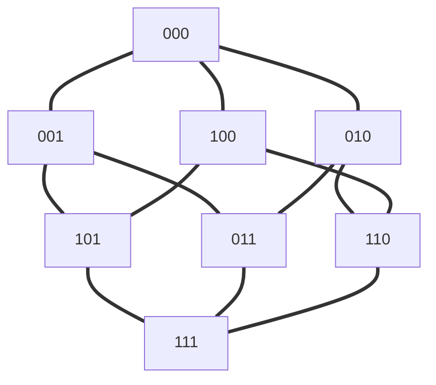
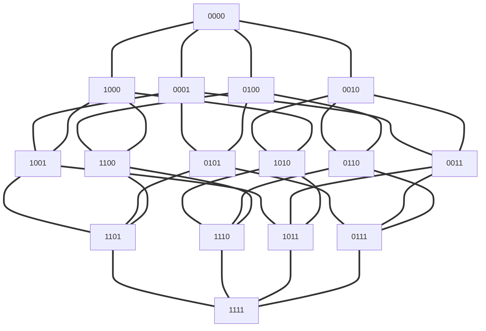

# Gray Code

An **n-bit gray code sequence** is a sequence of `2n` integers where:

- Every integer is in the **inclusive** range `[0, 2n - 1]`,
- The first integer is `0`,
- An integer appears **no more than once** in the sequence,
- The binary representation of every pair of **adjacent** integers differs by **exactly one bit**, and
- The binary representation of the **first** and **last** integers differs by **exactly one bit**.

Given an integer `n`, return *any valid **n-bit gray code sequence***.


## Fail Solution





1. 第一層為 4 x 0, 0 x 1
2. 第二層為 3 x 0, 1 x 1
3. 第m層為 m x 0, n-m x1
4. $ C^n_m $ x 1 


## Solution 

1. 複習格雷碼
2. 了解規律
    1. 0,1
    2. 00,01,11,10
    3. 
3. 寫程式

## ByMe

```php
class Solution {

    /**
     * @param Integer $n
     * @return Integer[]
     */
    function grayCode($n) {
        $list = [0,1];
        if ($n == 1){
            return $list;
        }
        for ($i = 1 ; $i < $n ; $i++){
            $list = $this->next($list);
        }

        return $this->transfrom($list);
    }
    
    function next($now){
        foreach($now as $ele){
            $tmp[] = 0 . $ele;
        }
        krsort($now);
        foreach($now as $ele){
            $tmp[] = 1 . $ele;
        }
        $list = $tmp;
        return $list;
    }

    function transfrom($list){
        $result = [];
        foreach($list as $e){
            $result[] = bindec($e);
        }
        return $result;
    }
}
```


解題思路

1. 初始化[0,1]
2. 複製上一份
3. 首位加0
4. 首位加1
5. 轉換成十進位

緩慢的原因是：

1. 還要_複製上一份_ 之外 還要_排序_
2. 之外還要轉換2進制


## By Bast

```php
class Solution2 {

    /**
     * @param Integer $n
     * @return Integer[]
     */
    function grayCode($n) {
        $result = [0];
        
        for ($i = 1; $i <= $n; $i++) {
            $resultLen = count($result);
            $mask = 1 << ($i - 1);
            for ($j = $resultLen - 1; $j >=0; $j--) {
                $result[] = $result[$j] + $mask;
            }
        }
        
        return $result;
    }
}
```


1. 一樣先初始化0
2. 但第一層就是加上去的
    1. 0,0+1
    2. 0,1,1+2,0+2
3. 進位是用位元
4. 也不用重新排序只要每次都倒序取就好
