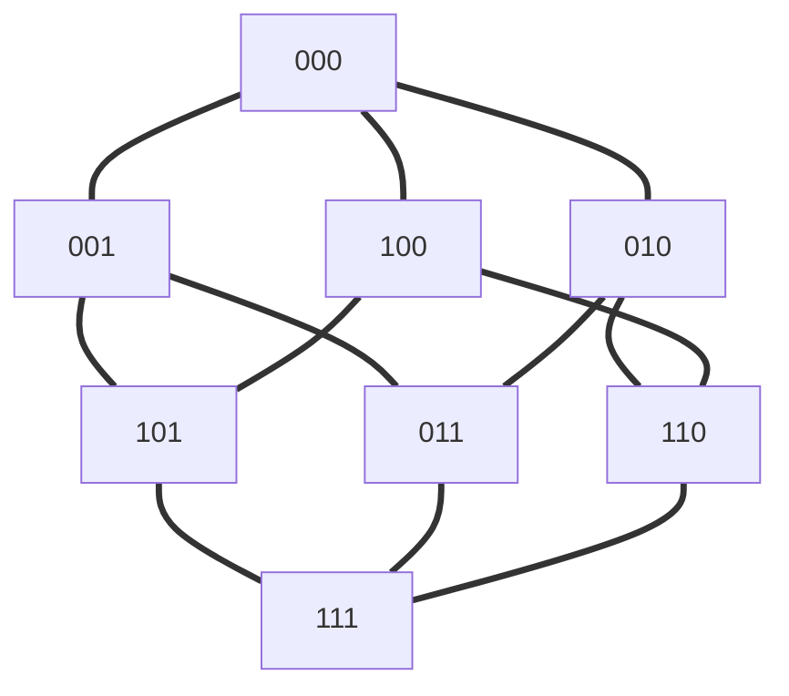

# Gray Code

An **n-bit gray code sequence** is a sequence of `2n` integers where:

- Every integer is in the **inclusive** range `[0, 2n - 1]`,
- The first integer is `0`,
- An integer appears **no more than once** in the sequence,
- The binary representation of every pair of **adjacent** integers differs by **exactly one bit**, and
- The binary representation of the **first** and **last** integers differs by **exactly one bit**.

Given an integer `n`, return *any valid **n-bit gray code sequence***.

## solution


graph TB;
  000 === 001
  000 === 010
  000 === 100
  001 === 101
  001 === 011
  010 === 011
  010 === 110
  100 === 101 
  100 === 110
  101 === 111
  011 === 111
  110 === 111
