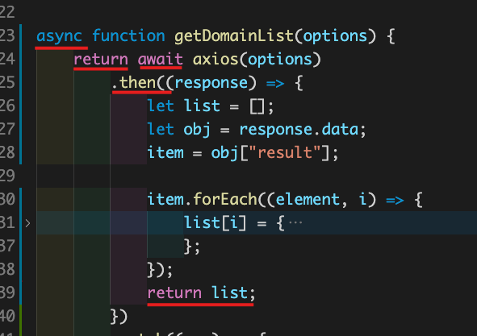

# Axios

1.   node 那件是異步
2.   所以要用Async / Await / Promise 處理
3.   [Async function / Await 深度介紹](https://wcc723.github.io/development/2020/10/16/async-await/)
4.   [axios](https://github.com/axios/axios)
5.   async function 內加return await
     1.   
